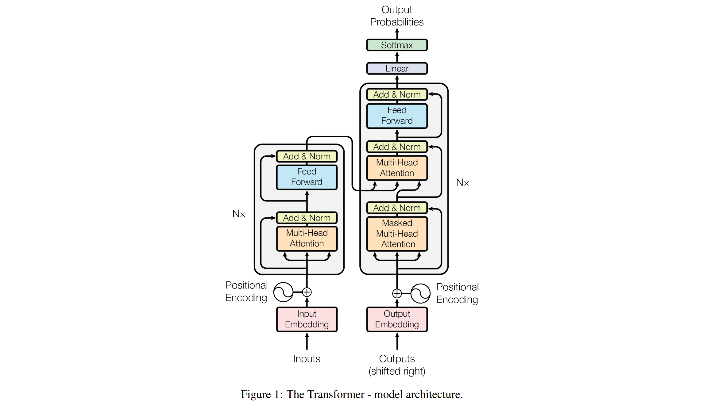
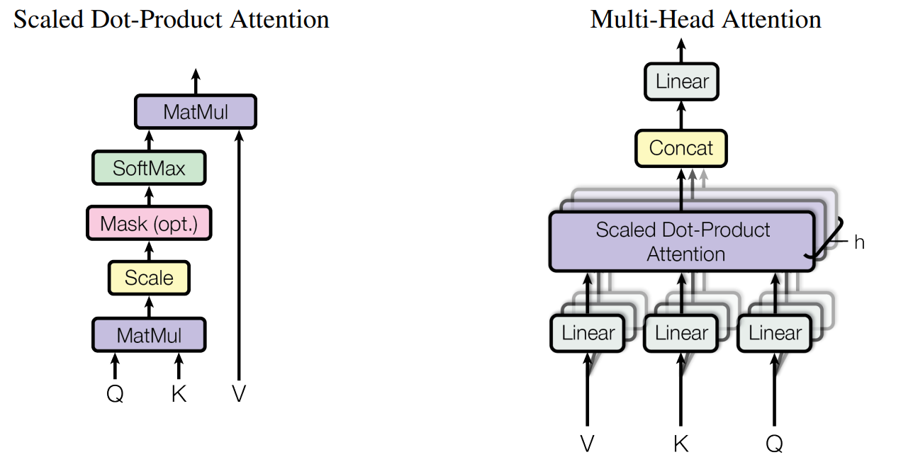

# LLM

## Transformer

首先瞻仰下开山之作、LLM万物起源**《Attention Is All You Need》**[^2]。尤其注意Transformer模型架构示意图：

在深入了解LLM前，先通过一个简单示例[^1]形象理解Transformer。

* Before encoder: Calculating Word embedding and positional embedding:

  * The vocabulary size determines the total number of **unique words** in our dataset.

  * Encoding: assign a unique number to each unique word

  * Word embedding: uses a n-dimensional embedding vector for each input word

  * positional embeddings: There are two formulas for positional embedding depending on the position of the ith value of that embedding vector for each word.

    > input 中 一个 word 的 positional embedding 是由它的 embedding、它在 input 中的序列决定

  * resultant matrix: This resultant matrix from combining both matrices (**Word embedding matrix** and **positional embedding matrix**) will be considered as an input to the encoder part.

* Calculating Multi Head Attention: A multi-head attention is comprised of many single-head attentions. It is up to us how many single heads we need to combine.

  * a single-head attention: There are three inputs: **query**, **key**, and **value**. Each of these matrices is obtained by multiplying a different set of weights matrix from the **Transpose** of same matrix that we computed earlier by adding the word embedding and positional embedding matrix.

    > query/key/value matrix = weights matrix(query/key/value) * trans(Word embedding matrix + positional embedding matrix)

    1. MatMul: mat1 = query * key
    2. Scale: mat2 = mat1 / sqrt(the dimension of our embedding vector)
    3. Mask(opt.): It helps the model understand things in a step-by-step manner, without cheating by looking ahead.
    4. SoftMax: mat3 = softmax(each cell in mat2)
    5. the resultant matrix from multi-head attention = mat3 * value = $softmax(\frac{Q \cdot K^T}{\sqrt{d_k}})\cdot V^T$

  * Once all single-head attentions output their resultant matrices, they will all be concatenated, and the final concatenated matrix is once again transformed linearly by multiplying it with a set of weights matrix initialized with random values, which will later get updated when the transformer starts training.

  

* Adding and Normalizing: Once we obtain the resultant matrix from multi-head attention, we have to add it to our original matrix. Then normalize the matrix.

  * To normalize the above matrix, we need to compute the mean and standard deviation row-wise for each row. We subtract each value of the matrix by the corresponding row mean and divide it by the corresponding standard deviation. Adding a small value of error prevents the denominator from being zero and avoids making the entire term infinity.

* After normalizing the matrix, it will be processed through a feedforward network.

* Adding and Normalizing Again: Once we obtain the resultant matrix from feed forward network, we have to add it to the matrix that is obtained from previous add and norm step, and then normalizing it using the row wise mean and standard deviation.

  * The output matrix of this add and norm step will serve as the query and key matrix in one of the multi-head attention mechanisms present in the decoder part.

----

* Decoder: We won’t be calculating the entire decoder because most of its portion contains similar calculations to what we have already done in the encoder. Instead, we only need to focus on the calculations of the input and output of the decoder.

  * When training, there are two inputs to the decoder. One is from the encoder, where the output matrix of the last add and norm layer serves as the **query** and **key** for the second multi-head attention layer in the decoder part. While the value matrix comes from the decoder after the first **add and norm** step.
  * The second input to the decoder is the predicted text. But the predicted input text needs to follow a standard wrapping of tokens that make the transformer aware of where to start and where to end.
    * `<start>` and `<end>` are two new tokens being introduced. 
    * The decoder takes one token as an input at a time. It means that `<start>` will be served as an input.

* Understanding Mask Multi Head Attention: In a Transformer, the masked multi-head attention is like a spotlight that a model uses to focus on different parts of a sentence. It’s special because it doesn’t let the model cheat by looking at words that come later in the sentence. Now, let’s understand the masked multi-head attention components having two heads:

  1. **Linear Projections (Query, Key, Value)**: Assume the linear projections for each head: Head 1: Wq1,Wk1,Wv1 and Head 2: Wq2,Wk2,Wv2

  2. **Calculate Attention Scores:** For each head, calculate attention scores using the dot product of Query and Key, and apply the mask to prevent attending to future positions.

  3. **Apply Softmax:** Apply the softmax function to obtain attention weights.

  4. **Weighted Summation (Value):** Multiply the attention weights by the Value to get the weighted sum for each head.

  5. **Concatenate and Linear Transformation:** Concatenate the outputs from both heads and apply a linear transformation.

     > This step helps capture different aspects of the input data from multiple perspectives, contributing to a richer representation that the model can use for further processing.

* Calculating the Predicted Word: 
  * The output matrix of the last add and norm block of the decoder must contain the same number of rows as the input matrix.
  * The last **add and norm block** resultant matrix of the decoder must be flattened in order to match it with a linear layer to find the predicted probability of each unique word in our dataset (corpus). This flattened layer will be passed through a linear layer to compute the **logits** (scores) of each unique word in our dataset.
  * Once we obtain the logits, we can use the **softmax** function to normalize them and find the word that contains the highest probability.
  * This predicted word (such as `you`), will be treated as the input word for the decoder, and this process continues until the `<end>` token is predicted.

[^1]: [Solving Transformer by Hand: A Step-by-Step Math Example | by Fareed Khan | Level Up Coding (gitconnected.com)](https://levelup.gitconnected.com/understanding-transformers-from-start-to-end-a-step-by-step-math-example-16d4e64e6eb1)
[^2]: [[1706.03762\] Attention Is All You Need (arxiv.org)](https://arxiv.org/abs/1706.03762)

